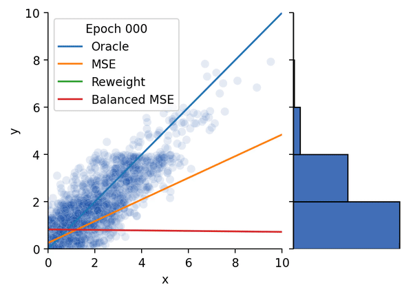

# Balanced MSE
Code for the paper:

**[Balanced MSE for Imbalanced Visual Regression](https://arxiv.org/abs/2203.16427)**  
Jiawei Ren, Mingyuan Zhang, Cunjun Yu, Ziwei Liu

CVPR 2022 (**Oral**)

<div align="left">
  
</div>

## News
- **[04/27/2022]** We have released the code for the [Synthetic Benchmark](./synthetic_benchmark), including **multi-dimensional Balanced MSE** and visualizations!
- **[03/31/2022]** Code release, with an [interactive demo](https://huggingface.co/spaces/jiawei011/Demo-Balanced-MSE) and a [hands-on tutorial](https://colab.research.google.com/github/jiawei-ren/BalancedMSE/blob/main/tutorial/balanced_mse.ipynb).

## Live Demo

Check out our [live demo](https://huggingface.co/spaces/jiawei011/Demo-Balanced-MSE) in the Hugging Face :hugs: space!

<div align="left">
  
</div>

## Tutorial

We provide a minimal working example of Balanced MSE using the BMC implementation on a small-scale dataset, 
[Boston Housing dataset](https://www.cs.toronto.edu/~delve/data/boston/bostonDetail.html). 

<p class="aligncenter">
    <a href="https://colab.research.google.com/github/jiawei-ren/BalancedMSE/blob/main/tutorial/balanced_mse.ipynb" target="_parent">
        
    </a> 
</p>

The notebook is developed on top of [Deep Imbalanced Regression (DIR) Tutorial](https://github.com/YyzHarry/imbalanced-regression/tree/main/tutorial),
we thank the authors for their amazing tutorial!

## Quick Preview
A code snippet of the Balanced MSE loss is shown below. We use the BMC implementation for demonstration,
BMC does not require any label prior beforehand.

### One-dimensional Balanced MSE
```python
def bmc_loss(pred, target, noise_var):
    """Compute the Balanced MSE Loss (BMC) between `pred` and the ground truth `targets`.
    Args:
      pred: A float tensor of size [batch, 1].
      target: A float tensor of size [batch, 1].
      noise_var: A float number or tensor.
    Returns:
      loss: A float tensor. Balanced MSE Loss.
    """
    logits = - (pred - target.T).pow(2) / (2 * noise_var)   # logit size: [batch, batch]
    loss = F.cross_entropy(logits, torch.arange(pred.shape[0]))     # contrastive-like loss
    loss = loss * (2 * noise_var).detach()  # optional: restore the loss scale, 'detach' when noise is learnable 

    return loss
```
`noise_var` is a one-dimensional hyper-parameter. `noise_var` can be optionally optimized in training:
```python
class BMCLoss(_Loss):
    def __init__(self, init_noise_sigma):
        super(BMCLoss, self).__init__()
        self.noise_sigma = torch.nn.Parameter(torch.tensor(init_noise_sigma))

    def forward(self, pred, target):
        noise_var = self.noise_sigma ** 2
        return bmc_loss(pred, target, noise_var)

criterion = BMCLoss(init_noise_sigma)
optimizer.add_param_group({'params': criterion.noise_sigma, 'lr': sigma_lr, 'name': 'noise_sigma'})

```
### Multi-dimensional Balanced MSE
The multi-dimensional implementation is compatible with the 1-D version.
```python
from torch.distributions import MultivariateNormal as MVN

def bmc_loss_md(pred, target, noise_var):
    """Compute the Multidimensional Balanced MSE Loss (BMC) between `pred` and the ground truth `targets`.
    Args:
      pred: A float tensor of size [batch, d].
      target: A float tensor of size [batch, d].
      noise_var: A float number or tensor.
    Returns:
      loss: A float tensor. Balanced MSE Loss.
    """
    I = torch.eye(pred.shape[-1])
    logits = MVN(pred.unsqueeze(1), noise_var*I).log_prob(target.unsqueeze(0))  # logit size: [batch, batch]
    loss = F.cross_entropy(logits, torch.arange(pred.shape[0]))     # contrastive-like loss
    loss = loss * (2 * noise_var).detach()  # optional: restore the loss scale, 'detach' when noise is learnable 
    
    return loss
```
`noise_var` is still a one-dimensional hyper-parameter and can be optionally learned in training.

## Run Experiments

Please go into the sub-folder to run experiments.

- [Synthetic Benchmark](./synthetic_benchmark)
- [IMDB-WIKI-DIR](./imdb-wiki-dir)
- [NYUD2-DIR](./nyud2-dir)
- IHMR (coming soon)

## Citation
```bib
@inproceedings{ren2021bmse,
  title={Balanced MSE for Imbalanced Visual Regression},
  author={Ren, Jiawei and Zhang, Mingyuan and Yu, Cunjun and Liu, Ziwei},
  booktitle={Proceedings of the IEEE/CVF Conference on Computer Vision and Pattern Recognition},
  year={2022}
}
```

## Acknowledgment

This work is supported by NTU NAP, MOE AcRF Tier 2 (T2EP20221-0033), the National Research Foundation, Singapore under its AI Singapore Programme, and under the RIE2020 Industry Alignment Fund – Industry Collabo- ration Projects (IAF-ICP) Funding Initiative, as well as cash and in-kind contribution from the industry partner(s).

The code is developed on top of [Delving into Deep Imbalanced Regression](https://github.com/YyzHarry/imbalanced-regression).


