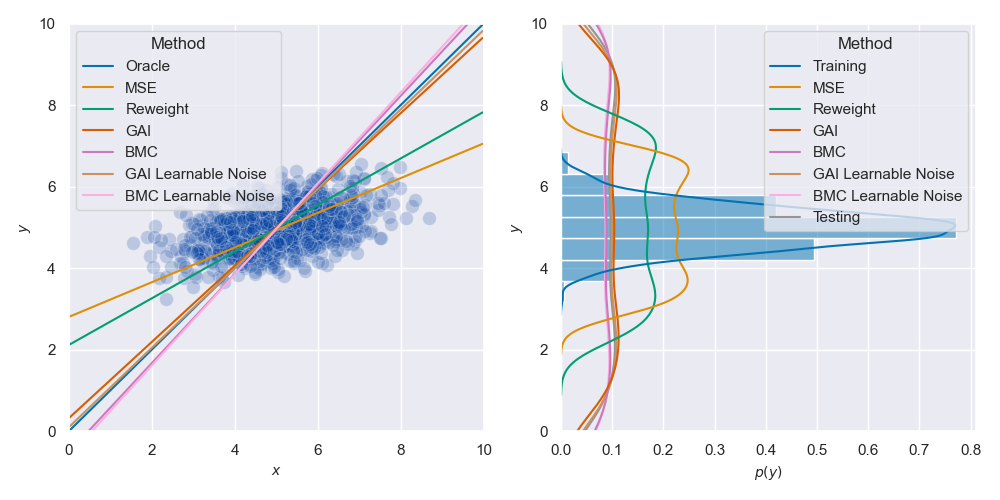
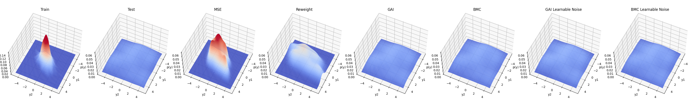

# Synthetic Benchmark

The synthetic benchmark includes 1-D & 2-D imbalanced linear regression. 
We implement multi-dimensional Balanced MSE and provide visualization code.

## 1-D Imbalanced Linear Regression
```shell
python main_1d.py
```
Change the distribution type and parameters in the `CONSTANT` section.
<div align="left">
  
</div>

## 2-D Imbalanced Linear Regression
```shell
python main_2d.py
```
Change the distribution type and parameters in the `CONSTANT` section.
<div align="left">
  
</div>